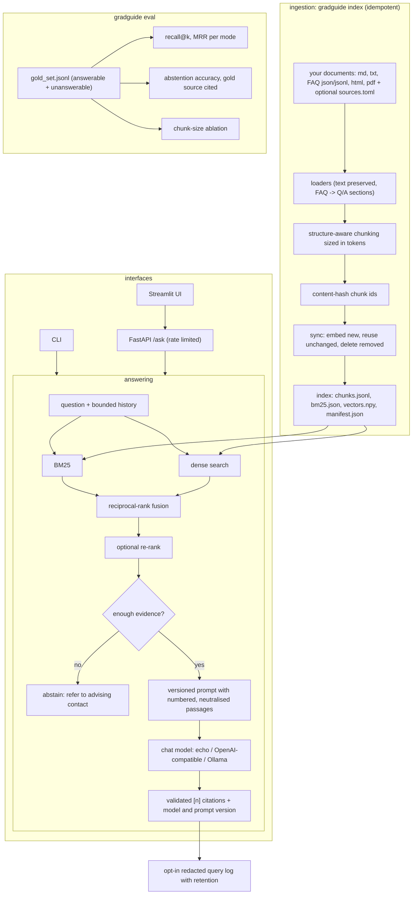

# gradguide

A document-grounded advising assistant for graduate students: point it at any institution's own policy documents and FAQs, and it answers questions about requirements, registration, graduation, assistantships and international-student rules with cited sources, or says it doesn't know.

[](https://github.com/KrishnaAnnavaram/gradguide/actions/workflows/ci.yml)

> **Status:** working MVP. Ingestion, an incremental hybrid index, grounded answers with citations and abstention, a CLI, an HTTP API, a Streamlit UI and an evaluation harness with real ablations all run end to end, offline by default. gradguide is institution-neutral: it ships only synthetic sample documents and contains no content from any real university.

## Features

- **Bring your own documents.** Markdown, plain text, FAQ JSON / JSONL, HTML and PDF. Text is kept exactly as written, so URLs, fees, e-mail addresses and phone numbers survive into answers.
- **FAQ files are first-class.** Each question/answer pair becomes its own chunk, instead of a serialised JSON blob.
- **Structure-aware chunking sized in tokens.** Chunks follow headings and paragraphs, carry a heading path (`Registration and Enrollment > Registration Holds`), and are sized with a token counter (a built-in approximation or `tiktoken`).
- **Idempotent, incremental indexing.** Chunk ids are content hashes. Re-indexing embeds only new or edited chunks, deletes removed ones, and loads straight from disk when nothing changed.
- **Hybrid retrieval.** BM25 and dense search fused with reciprocal-rank fusion, with an optional re-ranking stage (a dependency-free lexical reranker or a cross-encoder).
- **Grounded answers or abstention.** Passages are numbered in the prompt and citations are validated against them. When retrieval finds no supporting evidence, the assistant refers the student to an advising contact instead of calling the model.
- **Versioned prompts and traceable answers.** Prompt templates are versioned files, and every answer records the model, prompt version and retrieval mode that produced it.
- **Privacy by default.** No query logging unless you opt in. Opt-in logs are redacted (e-mails, phone numbers, ID-like numbers), never store answers or document text, and expire after a retention period. The API is rate limited, and retrieved text is neutralised against prompt-injection markup.
- **Source manifest.** An optional `sources.toml` records each document's owner and refresh cadence; `gradguide sources` flags stale documents.
- **Evaluation harness.** recall@k and MRR per retrieval mode, abstention accuracy on unanswerable questions, a gold-source citation check, and a chunk-size ablation that rebuilds the index for each size.
- **Pluggable providers.** Any OpenAI-compatible API or a local Ollama server, through the standard library only; deterministic fakes (a hashing embedder and an extractive echo model) for tests and offline demos.

## Architecture



## Quickstart

```bash
python -m venv .venv
. .venv/Scripts/activate              # Windows; use .venv/bin/activate on Linux/macOS
pip install -e ".[dev]"               # core + tests; extras: api, ui, pdf, tokens, rerank
pytest                                # offline, no API keys needed

cp .env.example .env                  # optional: providers, paths, privacy settings
gradguide index                       # build the index from sample_docs/ (incremental afterwards)
gradguide ask "When is the FAFSA priority deadline?"
gradguide chat                        # interactive session with bounded history
gradguide eval --chunk-sizes 60,120,220,400
gradguide sources                     # list documents, flag stale ones
gradguide serve                       # HTTP API on 127.0.0.1:8000 (pip install -e ".[api]")
gradguide ui                          # Streamlit UI (pip install -e ".[ui]")
```

To use your own institution's documents, set `GRADGUIDE_DOCS_DIR` to a folder containing them (and, optionally, a `sources.toml` like the one in [`sample_docs/`](sample_docs/)), set `GRADGUIDE_FALLBACK_CONTACT` to the office students should contact, and run `gradguide index`. Keep real documents out of version control; `/data/` and `/docs_private/` are git-ignored for that purpose.

With no configuration the offline providers are used. To run with a local model:

```bash
GRADGUIDE_LLM_PROVIDER=ollama GRADGUIDE_LLM_MODEL=llama3.1 \
GRADGUIDE_EMBED_PROVIDER=ollama GRADGUIDE_EMBED_MODEL=bge-m3 gradguide ask "How many credit hours is full-time?"
```

## Configuration

Environment variables (a `.env` file in the working directory is also read; real environment variables win). Relative paths are resolved against `GRADGUIDE_HOME` once, at start-up.

| Variable | Default | Meaning |
|---|---|---|
| `GRADGUIDE_HOME` | current directory | Base directory for relative paths |
| `GRADGUIDE_DOCS_DIR` | `sample_docs` | Documents folder |
| `GRADGUIDE_INDEX_DIR` | `.gradguide` | Index (and opt-in query log) folder |
| `GRADGUIDE_LLM_PROVIDER` | `echo` | `echo` (offline), `openai` (any OpenAI-compatible API) or `ollama` |
| `GRADGUIDE_LLM_MODEL` | `gpt-4o-mini` | Chat model name |
| `GRADGUIDE_EMBED_PROVIDER` | `hashing` | `hashing` (offline), `openai` or `ollama` |
| `GRADGUIDE_EMBED_MODEL` | `text-embedding-3-small` | Embedding model name |
| `GRADGUIDE_RERANKER` | `none` | `none`, `lexical` or `cross-encoder` (needs the `rerank` extra) |
| `GRADGUIDE_RERANK_MODEL` | `cross-encoder/ms-marco-MiniLM-L-6-v2` | Cross-encoder model |
| `GRADGUIDE_TOKENIZER` | `simple` | `simple` or `tiktoken` (needs the `tokens` extra) |
| `GRADGUIDE_CHUNK_TOKENS` | `220` | Maximum chunk size in tokens |
| `GRADGUIDE_CHUNK_OVERLAP_TOKENS` | `30` | Tokens carried between chunks of a section |
| `GRADGUIDE_TOP_K` | `4` | Passages given to the model |
| `GRADGUIDE_CANDIDATE_K` | `20` | Candidates per retriever before fusion / re-ranking |
| `GRADGUIDE_MIN_RELEVANCE` | `0.3` | Evidence threshold below which the assistant abstains |
| `GRADGUIDE_HISTORY_TOKENS` | `400` | Token budget for previous exchanges in the prompt |
| `GRADGUIDE_PROMPT_VERSION` | `v1` | Prompt template version |
| `GRADGUIDE_TEMPERATURE` | `0.1` | Sampling temperature |
| `GRADGUIDE_FALLBACK_CONTACT` | `your program's graduate advising office` | Who to contact when the assistant abstains |
| `GRADGUIDE_QUERY_LOG` | `off` | `on` enables the redacted query log |
| `GRADGUIDE_LOG_RETENTION_DAYS` | `30` | Query-log retention |
| `GRADGUIDE_RATE_LIMIT_PER_MINUTE` | `30` | API requests per client per minute (`0` disables) |
| `GRADGUIDE_API_URL` | | If set, the UI calls this API instead of running in-process |
| `OPENAI_API_KEY` | | Key for the OpenAI-compatible endpoint |
| `OPENAI_BASE_URL` | `https://api.openai.com/v1` | OpenAI-compatible base URL |
| `OLLAMA_HOST` | `http://localhost:11434` | Ollama server |

## Project structure

```
src/gradguide/
  config.py                 settings; paths resolved once against GRADGUIDE_HOME
  types.py                  Section, Document, Chunk, Hit, Citation, Answer
  ingest/loaders.py         md/txt, FAQ json/jsonl, html (stdlib parser), pdf (optional)
  ingest/chunking.py        heading/paragraph-aware chunking in tokens, content-hash ids
  ingest/tokens.py          token counters (simple, tiktoken)
  ingest/sources.py         sources.toml manifest and staleness check
  index/store.py            incremental sync, persisted index, manifest
  retrieve/text.py          search terms (lower-cased only for matching)
  retrieve/bm25.py          Okapi BM25
  retrieve/fusion.py        reciprocal-rank fusion
  retrieve/rerank.py        lexical and cross-encoder rerankers
  retrieve/hybrid.py        bm25 / vector / hybrid / hybrid+rerank, evidence score
  providers/                embedders and chat models (fakes, OpenAI-compatible, Ollama)
  generate/templates/       versioned prompt templates (system_v1.txt, user_v1.txt)
  generate/prompts.py       message assembly, injection neutralising, token-bounded history
  generate/citations.py     citation validation and source lists
  generate/answer.py        retrieve -> abstain or answer with citations
  privacy/querylog.py       opt-in redacted log with retention
  privacy/ratelimit.py      per-client rate limiting
  eval/                     metrics and the evaluation harness
  service.py                GradGuide facade used by every interface
  api.py                    FastAPI app (POST /ask, GET /health)
  app.py                    Streamlit UI
  cli.py                    `gradguide` command
sample_docs/                synthetic, institution-neutral documents + sources.toml
eval/gold_set.jsonl         35 hand-written questions (30 answerable, 5 unanswerable)
tests/                      offline pytest suite
```

## How it works

1. **Load.** Each file becomes a document of sections. Markdown, text and HTML are split at headings (HTML navigation, scripts and footers are dropped, and link targets are kept next to their text). FAQ JSON and JSONL become one section per question/answer pair; other JSON is rendered as readable `key: value` lines.
2. **Chunk.** Sections are packed paragraph by paragraph up to `CHUNK_TOKENS`, falling back to sentences and then words for very long paragraphs, with `CHUNK_OVERLAP_TOKENS` of carried context. FAQ pairs stay whole. Each chunk's id is a hash of its source, heading and text.
3. **Sync the index.** If the documents and settings are unchanged, the saved index is loaded. Otherwise the fresh chunk set is compared with the saved one: unchanged chunks keep their vectors, new chunks are embedded, and missing chunks are dropped.
4. **Retrieve.** BM25 and cosine similarity each rank the top candidates; reciprocal-rank fusion (`Σ 1 / (60 + rank)`) merges them, and an optional reranker reorders the fused list.
5. **Decide.** The evidence score of a passage is the larger of its query-term coverage and its cosine similarity. If no passage reaches `MIN_RELEVANCE`, the assistant abstains and names the fallback contact.
6. **Answer.** One prompt is assembled from the versioned templates: system rules, the history that fits the token budget, and the numbered passages with any passage/question tags in the text neutralised. Citation markers in the reply are checked against the passages shown; invalid ones are removed, and if none remain every shown passage is listed as a source.

## Evaluation

`gradguide eval` runs the gold set in [`eval/gold_set.jsonl`](eval/gold_set.jsonl): 30 answerable questions labelled with the file and section that answers them, and 5 off-topic questions the assistant should decline. Every row below comes from running that configuration, with the offline hashing embedder and echo model on the sample documents.

**Retrieval (30 answerable questions)**

| Mode | recall@1 | recall@3 | recall@5 | MRR |
|---|---:|---:|---:|---:|
| BM25 | 0.767 | 1.000 | 1.000 | 0.883 |
| vector (hashing embedder) | 0.900 | 0.967 | 1.000 | 0.936 |
| hybrid (RRF) | 0.767 | 1.000 | 1.000 | 0.883 |
| hybrid + lexical rerank | 0.767 | 1.000 | 1.000 | 0.878 |

**Answers (35 questions)**

| Metric | Value |
|---|---:|
| answer/abstain decision accuracy | 1.000 |
| false abstention rate (answerable questions declined) | 0.000 |
| missed abstention rate (off-topic questions answered) | 0.000 |
| gold source among the citations | 1.000 |

**Chunk-size ablation (hybrid; the index is rebuilt for each size)**

| Chunk tokens | Chunks | recall@1 | recall@3 | MRR |
|---|---:|---:|---:|---:|
| 60 | 48 | 0.767 | 1.000 | 0.878 |
| 120 | 34 | 0.767 | 1.000 | 0.883 |
| 220 | 34 | 0.767 | 1.000 | 0.883 |
| 400 | 34 | 0.767 | 1.000 | 0.883 |

How to read this: the sample corpus is tiny (34 chunks) and its sections are short, so chunk sizes above about 120 tokens produce the same index. On this set the fused ranking puts the gold section in the top 3 every time but is not better than dense search at rank 1, mostly because short FAQ answers win BM25 ties; the lexical reranker does not help. These numbers show the harness working, not real-world quality. The abstention threshold was checked against this same small set, so tune `GRADGUIDE_MIN_RELEVANCE` on a gold set built from your own documents and questions. The "gold source among the citations" check is a citation sanity check, not a hallucination detector; the roadmap adds faithfulness scoring.

## Testing

```bash
pip install -e ".[dev,api]"
pytest -q
```

The suite is offline and uses the fake providers. The API test runs when FastAPI is installed, and the UI test runs headlessly when Streamlit is installed. Each problem found in the earlier prototype has a regression test:

| Earlier problem | Fix | Test |
|---|---|---|
| Retrieval-mode comparison used random labels | Every mode is a real code path; reports are deterministic | `test_retrieval.py`, `test_eval.py` |
| FAQ JSON could never be retrieved | FAQ files parsed into Q/A sections; no brace filter | `test_loaders.py`, `test_retrieval.py` |
| "Token" chunk sizes were characters; newlines collapsed | Token-counted, paragraph-aware chunking | `test_chunking.py` |
| Similarity thresholds labelled as "hallucination" | Honestly named metrics: abstention accuracy, gold source cited | `test_eval.py` |
| Reported model differed from the model called | Model and prompt version stored on every answer | `test_answering.py` |
| Paths depended on the working directory | Paths resolved once against `GRADGUIDE_HOME` | `test_answering.py` |
| Re-indexing duplicated or kept stale chunks | Content-hash ids, incremental sync with deletes | `test_index.py` |
| Local pipeline lower-cased and stripped text | Text preserved; only search terms are normalised | `test_loaders.py` |
| Unbounded history; model called with empty context | Token-budgeted history; abstention without a model call | `test_answering.py` |
| Logging everything forever; no rate limit or injection guard | Opt-in redacted log with retention, rate limiter, passage neutralising | `test_privacy.py`, `test_answering.py`, `test_config_and_api.py` |
| Broken dependencies | `pyproject.toml` with a small core (numpy) and optional extras; CI installs from scratch | CI |
| No retrieval metrics on a gold set | recall@k, MRR, abstention set, chunk-size ablation | `test_eval.py` |

## Roadmap

- [x] **M1:** loaders, token-sized structure-aware chunking, idempotent incremental index with a source manifest
- [x] **M2:** hybrid retrieval with RRF, optional re-ranking, gold-set retrieval metrics
- [x] **M3:** grounded generation with versioned prompts, validated citations and abstention
- [x] **M4 (partial):** evaluation harness with real mode and chunk-size ablations and abstention checks
- [x] **M5 (partial):** FastAPI service, Streamlit UI, opt-in redacted logging, rate limiting
- [ ] Faithfulness and answer-correctness scoring (LLM judge plus human spot checks)
- [ ] Larger gold set built from a real institution's public documents (kept outside this repository)
- [ ] Dockerfile and compose file with an Ollama service
- [ ] Scheduled re-fetching of web sources listed in the manifest
- [ ] Streaming responses in the API and UI

## Limitations

- The echo model only quotes sentences from the retrieved passages; use a real model for real answers.
- The hashing embedder measures word and character overlap, not meaning. Paraphrased questions need a real embedding model.
- The abstention rule is a simple evidence threshold; it can still answer loosely related questions or decline unusual phrasings.
- Search terms are English-oriented (stopwords and plural folding).
- PDFs are read page by page without layout analysis; scanned PDFs need OCR first.
- Answers summarise documents and are not official advice; students should confirm decisions with their advisor.

## License

MIT © 2026 Krishna Annavaram. See [LICENSE](LICENSE).
